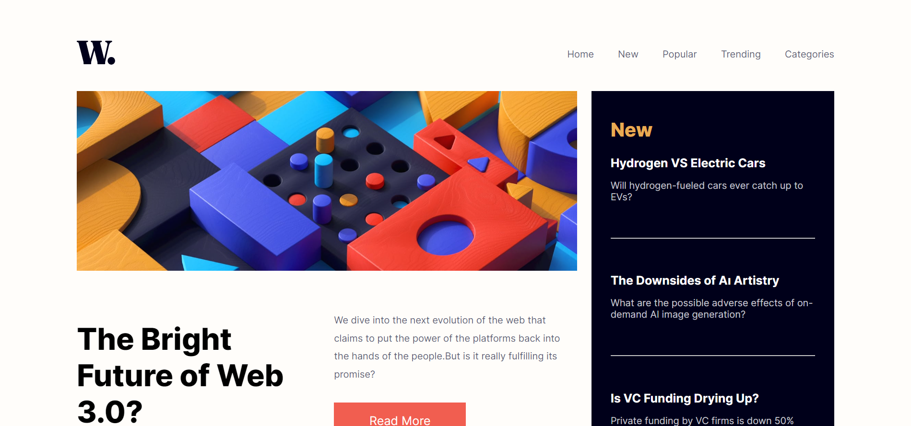

### News homepage

Users should be able to:

- View the optimal layout for the interface depending on their device's screen size
- See hover and focus states for all interactive elements on the page

### Screenshot

### Links

- Solution URL: [https://www.frontendmentor.io/solutions/news-homepage-6IQWbsI5xV](https://www.frontendmentor.io/solutions/news-homepage-6IQWbsI5xV)
- Live Site URL: [https://unaygney.github.io/newsHomepage/](https://unaygney.github.io/newsHomepage/)

## My process

### Built with

- Semantic HTML5 markup
- CSS custom properties
- Flexbox
- CSS Grid
- Mobile-first workflow

### What I learned

While i was working this project , i learned grid system. While trying to get the project up and running, I learned a lot about the grid system. I had a lot of fun and had a hard time doing it.

